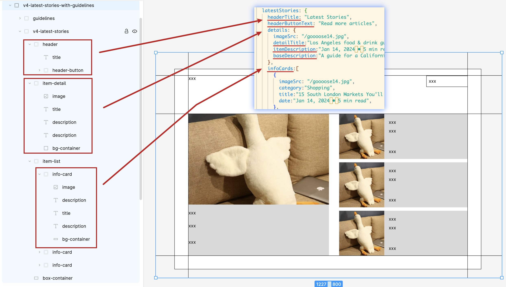
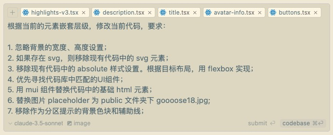

# 由图生成页面布局

这是一场有关由图生成页面布局、结合 AI 辅助的实验练习记录。

[参考图片地址](https://www.pinterest.com/pin/125045327150378894/)

## 实验记录

### V1 手动辅助线引导 + 对话调整最终效果

- 根据经验手动绘制辅助线，示意定位，并将完整目标图作为输入，告知 AI 最终生成目标（但此刻暂停生成，仅作为参考信息录入）
- 根据经验截取局部，以组件为单位，要求 AI 根据图示布局生成相应代码
- 图片所不能直接暴露出的动态效果（例如横向滚动、纵向滚动等需求）作为补充信息录入

### V2 figma 信息导入

> 目标是能生成更精准的样式

在 figma 中根据开发过程的嵌套思路（flex 布局，嵌套等），将目标图分组，并设置好组名，方便后续导入。 通过 figma 插件，生成基础的组件代码和组件样式（此时仍包含部分不想要的样式和元素例如 absolute, svg 等）

将 figma 中绘制的目标布局以图片形式录入，并导入代码组件，要求 AI 根据目标样式，替换掉现有代码中不想要的样式和元素例如 absolute, svg 等，例如：

> 根据图示布局以及现有各元素的嵌套层级，修改当前代码，要求：
>
> 1. 忽略背景的宽度、高度设置；
> 2. 移除现有代码中的 svg 元素；
> 3. 移除现有代码中的 absolute 样式设置。根据目标布局，用 flexbox 实现；
> 4. 用 mui 组件替换代码中的基础 html 元素；
> 5. 注意保持现有样式中的圆角、宽高、间距、字号、渐变等样式；
> 6. 替换图片 placeholder 为 public 文件夹下 goooose18.jpg;
> 7. 移除作为分区提示的背景色块；

注意可能出现的问题：

- 布局的解决思路不止一种，一键生成最终理想的 flex 布局的结果所需要的额外描述，不如直接自己写
- 有的地方需要 absolute 布局，一键替换可能会导致理想代码被排除

---

存在一定对应逻辑关系的区块子项布局排版：

> 最后 移除作为分区提示的 **背景色块** 和 **辅助线** ；

### v3 figma 布局关系导入 + 代码库 common ui 组件匹配

> 目标是更好的管理相关样式，遵守一定的设计规律

在使用 cursor 对代码进行样式优化时，将代码库中的 ui 组件作为参考文件导入。

> 1. 优先寻找代码库中匹配的 UI 组件；（此行优先）
> 2. 用 mui 组件替换代码中的基础 html 元素；

样式以组件为单位进行替换，整体布局需要额外的局部微调。

### todo

- [ ] V4 能同步生成测试代码，保证代码质量...
