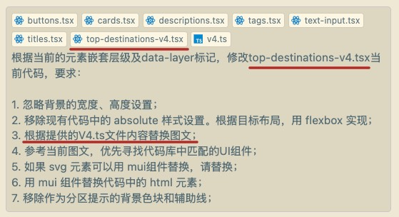

# 由图生成页面布局

这是一场有关由图生成页面布局、结合 AI 辅助的实验练习记录。


[参考图片地址](https://www.pinterest.com/pin/125045327150378894/)

## 实验记录

### V1 手动辅助线引导 + 对话调整最终效果

<details>
<summary><i>点击查看详情</i></summary>


- 根据经验手动绘制辅助线，示意定位，并将完整目标图作为输入，告知 AI 最终生成目标（但此刻暂停生成，仅作为参考信息录入）
- 根据经验截取局部，以组件为单位，要求 AI 根据图示布局生成相应代码
- 图片所不能直接暴露出的动态效果（例如横向滚动、纵向滚动等需求）作为补充信息录入

</details>

### V2 figma 信息导入

<details>
<summary><i>点击查看详情</i></summary>

> 目标是能生成更精准的样式


在 figma 中根据开发过程的嵌套思路（flex 布局，嵌套等），将目标图分组，并设置好组名，方便后续导入。 通过 figma 插件，生成基础的组件代码和组件样式（此时仍包含部分不想要的样式和元素例如 absolute, svg 等）


将 figma 中绘制的目标布局以图片形式录入，并导入代码组件，要求 AI 根据目标样式，替换掉现有代码中不想要的样式和元素例如 absolute, svg 等，例如：

> 根据图示布局以及现有各元素的嵌套层级，修改当前代码，要求：
>
> 1. 忽略背景的宽度、高度设置；
> 2. 移除现有代码中的 svg 元素；
> 3. 移除现有代码中的 absolute 样式设置。根据目标布局，用 flexbox 实现；
> 4. 用 mui 组件替换代码中的基础 html 元素；
> 5. 注意保持现有样式中的圆角、宽高、间距、字号、渐变等样式；
> 6. 替换图片 placeholder 为 public 文件夹下 goooose18.jpg;
> 7. 移除作为分区提示的背景色块；

注意可能出现的问题：

- 布局的解决思路不止一种，一键生成最终理想的 flex 布局的结果所需要的额外描述，不如直接自己写
- 有的地方需要 absolute 布局，一键替换可能会导致理想代码被排除

---

存在一定对应逻辑关系的区块子项布局排版：


> 最后 移除作为分区提示的 **背景色块** 和 **辅助线** ；

</details>

### V3 figma 布局关系导入 + 代码库 common ui 组件匹配

<details>
<summary><i>点击查看详情</i></summary>

> 目标是更好的管理相关样式，遵守一定的设计规律


在使用 cursor 对代码进行样式优化时，将代码库中的 ui 组件作为参考文件导入。

**如果对应 ui 文件没有进行导入的话，也无法进行正常识别。**

快捷操作：

`shift + ctrl` 批量选中，`右键` 选择导入文件至 cursor chat。


> 1. 优先寻找代码库中匹配的 UI 组件；（此行优先）
> 2. 用 mui 组件替换代码中的基础 html 元素；

样式以组件为单位进行替换，整体布局需要额外的局部微调。

</details>

### V4 figma 布局关系导入 + 代码库 common ui 组件匹配 + json 图文匹配


figma 的信息导入能提供一定的布局生成上的指导。常量图文数据相较于 figma 提供的 data-layer 数据，能提供更精准的组件匹配上的指导。

当 figma 信息出现表意不明的情况：如图中所示 description 出现了多次且参考填充内容均是 xxx，根据 AI 生成测试验证，description 的内容填充和组件匹配会**根据提供的参考常量图文的顺序进行填充替换**。



> 根据当前的元素嵌套层级及 data-layer 标记，修改 xxx.tsx 当前代码，要求：
>
> 1. 忽略背景的宽度、高度设置；
> 2. 移除现有代码中的 absolute 样式设置。根据目标布局，用 flexbox 实现；
> 3. 根据提供的 V4.ts 文件内容替换图文；
> 4. 参考当前图文，优先寻找代码库中匹配的 UI 组件；
> 5. 如果 svg 元素可以用 mui 组件替换，请替换；
> 6. 用 mui 组件替换代码中的 html 元素；
> 7. 移除作为分区提示的背景色块和辅助线；


一些特殊的复杂的样式效果（例如局部强调色、渐变色、文字截断、透明度效果等），需要额外补充说明。

### V5 figma 组件导出生成 ui 组件 + 代码库常量文件存储 prompt

[100 card design templates UI kit](https://www.figma.com/community/file/1097964499926853798)


> 根据现有各元素的嵌套层级，修改当前代码，要求：
>
> 1. 将此段代码根据最外层的 div 抽成组件，并支持传参；
> 2. 如果不存在 absolute 布局，则跳过此条指令。存在 absolute 布局，则移除现有代码中的 absolute 样式设置，根据目标布局，用 flexbox 实现;
> 3. 保持当前元素样式；
> 4. 用 mui 组件替换代码中基础 html 元素；
> 5. 以步骤 4 的结果为基准，用 mui card 组件进行替换。

此段 prompt 可以对多个组件同时进行操作（个人尝试最多 4 个，代码约 800 行）。但存在问题：

- 如果组件中存在绝对定位的元素，例如图片上方悬浮的固定 tag 或 button，会在第 2 步中被移除，替换成冗余的 flex 布局。
- 直接用 mui card 组件进行替换，有可能导致样式异常。
- 部分 sx 样式设置失效，需查看具体的 mui 文档查看样式设置：

  - 例如：

    ```typescript
    <TextField
      variant="outlined"
      placeholder="Enter your email"
      slotProps={{
        input: {
          sx: {
            borderRadius: "50px",
            bgcolor: "white",
          },
        },
      }}
    />

    // 在 mui 的 textField 组件中，input 样式需要使用 slotProps.input.sx 来设置样式，而不是直接在组件中设置。
    ```


当只利用 figma 的布局信息，剩余信息全部由代码库中常量文件提供并作为代码组件指引时：

- prompt 的指引不明（指示词包含代词例如 “当前、此项”），匹配错误的概率高；
- 同样的 prompt 语句，执行顺序不同，结果不同；
- 与大模型的选择有关，但何种 prompt 语句能更好的引导大模型生成更符合预期的结果，需要更多的实验。
- 一键生成需要很精准的 prompt 指引，而这引申出来的是对执行逻辑的高度清晰化。而且在一步步的 prompt 指引中，每一步都可能产生差错需要微调。是否追求一键生成目标效果，投入产出比如何，有待考量。


下一步考量是否可以通过 prompt 常量分步执行。

### todo

- [ ] V6 能同步生成测试代码，保证代码质量...
